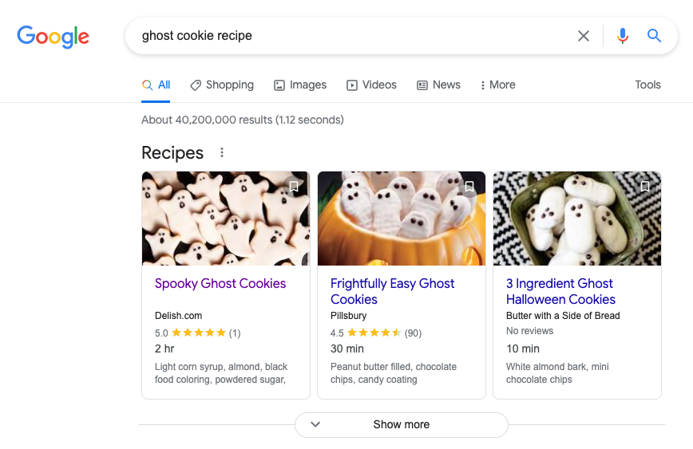
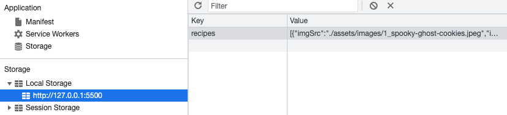
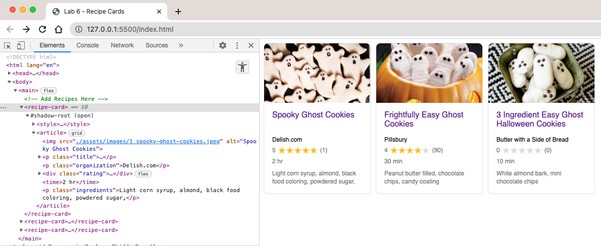

# Lab Week 7 - Web Components & localStorage API

## **Lab 7 Logistics**

🎳**Working in teams**

To encourage team bonding and to get to know people on your team better, you can work on this lab with a group member from your existing project team. If your existing team has an odd number of teammates, you can only work on a team of 3 if all other teammates have paired up. **_You cannot work with the same partner as last time nor can you work with someone on another team._**

## **Introduction**

**It is important that you read through this lab carefully.**

In the previous labs we learned how JavaScript interacts with the [Document Object Model (DOM)](https://developer.mozilla.org/en-US/docs/Web/API/Document_Object_Model/Introduction) and some of its APIs. This week, we’ll be adding on top of what you learned by reading data from local storage, plugging it into custom web components that you will create yourself, and then inserting these custom elements into the DOM when the page loads. This might sound a bit daunting initially, but it’s a lot more straightforward than you might expect. 

Those of you familiar with object-oriented programming might be pleased to find out that custom elements are very similar using JavaScript classes. If you’re unfamiliar or need to brush up, we’ll link some resources below.

When creating custom components in this lab you might come across some new terms that sound a bit odd or confusing, but I promise they only sound that way. One of those terms is the [**Shadow DOM**](https://developer.mozilla.org/en-US/docs/Web/Web_Components/Using_shadow_DOM). What is the Shadow DOM? It is helpful to think of it as a scoped subtree of the regular DOM. Scoped here meaning that it is encapsulated from the rest of the DOM. Each component you create will have its own Shadow DOM all to itself. It’s handy in this sense as you can add as much CSS & JS to a component as you please without having to worry that that style or code will bleed into the regular DOM. It also follows that since the regular DOM is a tree and has a root element (<html>) that the Shadow DOM has a root as well referred to as the Shadow Root.

### **Resources**

We will only be linking to more academically minded resources here as they are more likely to have accurate information, but if you find the concept of custom elements a bit confusing there are tons of other resources and videos you’re free to look up and use.

- [https://developer.mozilla.org/en-US/docs/Web/API/Window/localStorage](https://developer.mozilla.org/en-US/docs/Web/API/Window/localStorage)
- [https://developer.mozilla.org/en-US/docs/Web/JavaScript/Reference/Classes](https://developer.mozilla.org/en-US/docs/Web/JavaScript/Reference/Classes)
- [https://developer.mozilla.org/en-US/docs/Web/Web_Components](https://developer.mozilla.org/en-US/docs/Web/Web_Components)
- [https://developer.mozilla.org/en-US/docs/Web/Web_Components/Using_custom_elements](https://developer.mozilla.org/en-US/docs/Web/Web_Components/Using_custom_elements)
- [https://developer.mozilla.org/en-US/docs/Web/Web_Components/Using_shadow_DOM](https://developer.mozilla.org/en-US/docs/Web/Web_Components/Using_shadow_DOM)

**Highly Recommended:**

Go through this quick 9-minute crash course on the basics of the shadow DOM before you proceed:

- [https://www.youtube.com/watch?v=bNwZkSGUAqk](https://www.youtube.com/watch?v=bNwZkSGUAqk)

### **Set Up**

- Join the #lab-7 channel on Slack to ask or help answer your classmates’ questions.
- Fork this weeks repo to get the starter code: [https://github.com/JonathanYin/lab7-starter/tree/master](https://github.com/JonathanYin/lab7-starter/tree/master)

## **Part 1 - Expose** 

In this section, we’ll be making the recipe cards you might have seen that pop up on google. We'll be using custom [web components](https://developer.mozilla.org/en-US/docs/Web/Web_Components/Using_custom_elements), the [Shadow DOM](https://developer.mozilla.org/en-US/docs/Web/Web_Components/Using_shadow_DOM), and the [localStorage API](https://developer.mozilla.org/en-US/docs/Web/API/Window/localStorage) to make them. Below is an example picture:



We have included all of the markup and styling that you will need, as well as a template for what your markup should look like in a file called **cardTemplate.html** (if your markup for your cards doesn’t follow this template the correct styles won’t be applied)

### **Ready to Start?**

_You may only modify the following files:_ **_main.js_**_,_ **_RecipeCard.js_** _in this portion of the lab_

To understand what’s going on, take a look at the following files: **index.html**, **cardTemplate.html**, **recipes.json**, **RecipeCard.js,** and **main.js**

#### **index.html**

**Do not modify this file yet.**  It contains a basic wrapper element to hold your recipe cards.

       ***`<main></main>`***

Inside of `<main>` is where you will append a custom web component called `<recipe-card>` for each recipe.

There is also another element below `<main>`

       ***`<form></form>`***

We'll get to this form later in the **Explore** section

#### **reference/cardTemplate.html**

**Do not modify this file.** Contains HTML and CSS you will use to create your <recipe-card> components

#### **reference/recipes.json**

**Do not modify this file.** These are the initial recipes that we will be loading into localStorage.

**Step 0 of this assignment:**

- Open **index.html** using the Live Server VSCode extension, it should have an URL similar to **127.0.0.1:5500** (or a similar port number)
- Open your DevTools and navigate to the Console
- Copy the entire array from **reference/recipes.json** (when grading, we may manually input out own recipe card instead of populating the recipes in the console)
- Enter the following code into the console:

```
localStorage.setItem('recipes', JSON.stringify(PASTE RECIPES ARRAY HERE));
```

Now if you navigate to Application --> Local Storage --> [http://127.0.0.1:5500](http://127.0.0.1:5500/) you should be able to see that array in your localStorage



#### **assets/scripts/RecipeCard.js**

**Modify this file.** This file should contain the code to create a custom [web component](https://developer.mozilla.org/en-US/docs/Web/Web_Components) called RecipeCard. For the **EXPOSE** section, complete all of the numbers starting with A that have a TODO next to them. This file should contain numbers A1 through A8

#### **assets/scripts/main.js**

**Modify this file.** This is the JavaScript entry point that reads the recipe JSON files from local storage that you set in **Step 0** and converts that data to HTML elements by creating the custom web components defined in **RecipeCard.js**. For the **EXPOSE** section, you will need to implement all of the numbers starting with A that have a TODO next to them. This file should contain numbers A9 through A11.

After everything, it should look like this:



**Relevant resources:**

- Web Components Introduction: [https://developer.mozilla.org/en-US/docs/Web/Web_Components](https://developer.mozilla.org/en-US/docs/Web/Web_Components)
- Using Custom Elements: [https://developer.mozilla.org/en-US/docs/Web/Web_Components/Using_custom_elements](https://developer.mozilla.org/en-US/docs/Web/Web_Components/Using_custom_elements)
- Using the Shadow DOM: [https://developer.mozilla.org/en-US/docs/Web/Web_Components/Using_shadow_DOM](https://developer.mozilla.org/en-US/docs/Web/Web_Components/Using_shadow_DOM)

## **Part 2 - Explore**

_You may only modify the following files:_ **_main.js\_\_,_** _**RecipeCard.js, index.html**_ _in this portion of the lab_

For this section, we are going to make a functional `<form>` so that we can add recipes to our array in localStorage, and also have the ability to clear all of localStorage.

#### **index.html**

**Modify this file.** The only modification to this file that we'll make is to remove the `class="hidden"` from the `<form>` element so that it will render on the screen.

#### **assets/scripts/main.js**

**Modify this file.** This file will now also be adding some event listeners to the `<form>` so that we can add to our recipes. For the **EXPLORE** section, you will need to implement all of the numbers starting with B that have a TODO next to them. This file should contain numbers B1 through B13.

NOTE: The **imgSrc** property takes in an image URL. You can point this to any image URL you like, though some websites may have headers that block you from accessing that URL on page load. Probably for the best that you download any 3rd party images you want to use for testing and place them next to the included images.

Here is a video of what the finished Explore section should look like:


## **Part 3 - Expand (No points)**

For this weeks Expand section, we're going to let you check out some other technologies that we didn't have time to make a whole lab on. Pick any or all of the following to complete. Do not modify any of the original files that you made in the previous two sections, simply duplicate what you need and place it in a new directory titled **expand**

- Recreate this lab using the **lit.dev** web component framework [https://lit.dev/](https://lit.dev/)
- Recreate this lab in your other framework of choice (e.g. **React**, **Vue**, **Angulur**, etc)
  - If you go this route, write up a short summary (titled **summary.md**, place it in the new **expand** directory you made) talking about the some differences you noticed between native web components and the framework, as well as which you preferred and why.
- Rewrite the CSS to use CSS variables whenever it makes sense

### **Gradescope Submission:**

**Please remember to add your partner(s) to the Gradescope submission if you worked with anyone else!**

- Link to your repository

- Please publish your site through Github Pages and include the link of the published site in a README.md file.
- Make sure both partners have their names in the README.md
